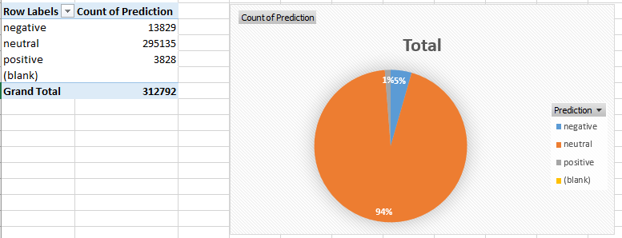

### Olympics_Tokyo_tweets_Sentiment_Analysis.ipynb --  classifier model
### sanders_tweets_train.txt -- training data
### result_olympic.csv -- data prepared -- test data
### result_olympic_predict.csv -- predict result(csv)
### result.png -- predict result(png)
### 

***
### unprepared_olympic_predict.csv -- predict result(Raw data & csv)