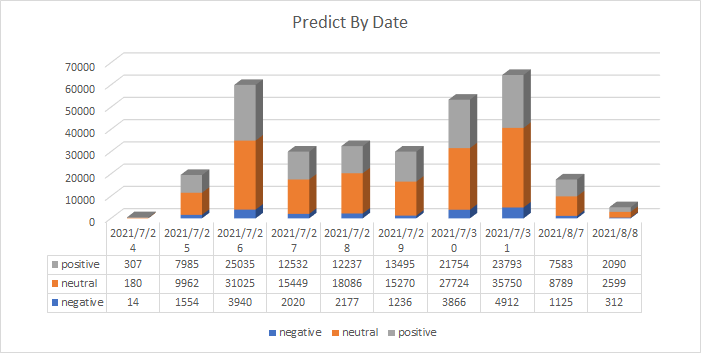
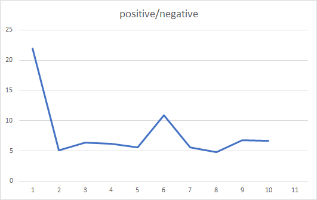

### Olympics_Tokyo_tweets_Sentiment_Analysis.ipynb --  classifier model
### train.csv -- training data

### Olympics_Tokyo_tweets.csv -- test data

### csvhandle.ipynb -- csv handle function

### predictall.csv -- predict result
### predictall_parallel.csv -- predict result by parallel

### dataBydate -- raw data by date

### predictBydate -- predict result by date

### predictBydateStatistics.xlsx -- Statistics  of result by date

